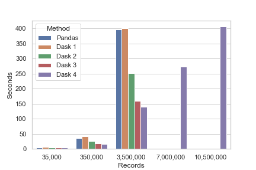
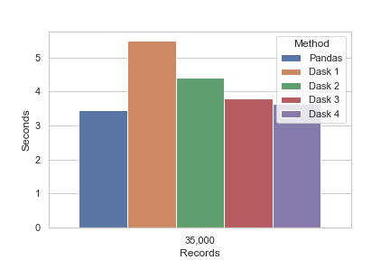
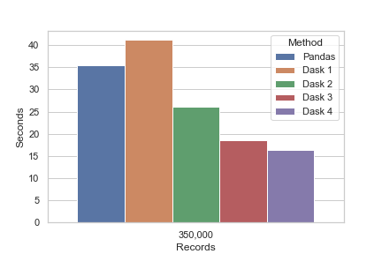

# dask_dataframe_experiment

This experiment arose from a work project where we needed to convert a Pandas dataframe into a custom binary file using special encoding.

In this project, there will be three parts:

- Part 1 - Get Data from a random data generator
- Part 2 - Convert the data using Pandas DataFrame
- Part 3 - Convert the data using Dask DataFrame

Hardware:
- CPU - Intel i7-7700HQ (4 cores with hyper-threading)
- RAM - 16 GB
- GPU - NVIDIA 1060 Max-Q (6 GB)

Software:
- Python 3.7.6 (Miniconda)
- Jupyter Notebook

## Results

Well ... it was interesting!

As expected, the Pandas method to convert the DataFrame into a binary fine scaled dramatically. However, it did successfully run the test with 35 million rows of data in 73 minutes and 29 seconds. It seems that Pandas has memory protection.

Dask also scaled as expected, reducing the amount of time taken to processs the data with the increase in the number of 2-thread workers. However, the 4 worker test with 35 million rows failed with a MemoryError, so the other 1, 2 and 3 worker tests were not executed.

The tests consisted of the 5 methods: Pandas, and Dask with 1, 2, 3, and 4 workers with 2 threads each. Each of the methods, ran on 3 sets of data of increasing size: 35,000, 350,000 and 3,500,000 rows of data.

Note - The planned test with 35 million rows of data was only successfully run using the Pandas method.

To test scaling of data for the 4 worker Dask method, 2 additional test were run with 2 and 3 times the 3.5 million rows of data. This brought the RAM usage close to the available RAM, so additional tests were not run at this time.

The first image shows the seconds taken for each method grouped by the number of records.



And because the scale makes it hard to see the differences in the first 2 groups, the next 2 images show the results for the 2 smaller record dataframes.





The raw results in list format are:

```python
	results_list = [
	    ['Pandas', '35,000', 3.45],
	    ['Pandas', '350,000', 35.40],
	    ['Pandas', '3,500,000', 396.00],
	    
	    ['Dask 1', '35,000', 5.50],
	    ['Dask 1', '350,000', 41.26],
	    ['Dask 1', '3,500,000', 401.00],
	    
	    ['Dask 2', '35,000', 4.40],
	    ['Dask 2', '350,000', 26.02],
	    ['Dask 2', '3,500,000', 251.79],
	    
	    ['Dask 3', '35,000', 3.81],
	    ['Dask 3', '350,000', 18.52],
	    ['Dask 3', '3,500,000', 158.70],
	    
	    ['Dask 4', '35,000', 3.65],
	    ['Dask 4', '350,000', 16.34],
	    ['Dask 4', '3,500,000', 139.67],
	    ['Dask 4', '7,000,000', 272.21],
	    ['Dask 4', '10,500,000', 406.21],
	]
```

## Observations

Pandas is the best choice for small data, for example the dataframe with 35,000 rows. Depending on the processing, it may also work well for larger data sets. This experiment also didn't account for the likelihood that there could be algorithmic efficiencies that would make one method faster.

Assuming you have access to a medium to high end CPU, you may find speed gains by using Dask data frames fairly quickly. That is, if you still have the RAM capacity to support the data size.

Note - The laptop that this experiment was first tested on had only 2 cores, and it struggled to show any gains using Dask. Be realistic! If your hardware is low to medium level, likely you will not see any gains.

Using 4 workers showed the fastest times for the larger data. However, the difference between the 3 worker test was comparitively smaller compared to the progressive time gaps between the 1 and 2 worker tests.

### Conclusion

I would recommend Dask for local computer applications, in some situations. My colleagues have brought some fairly hefty files to me asking why Pandas takes so long. After spending time vectorizing the alogorithm as much as I could, Dask seemed like the logical choice to get even more performance. After all, when the processing finally is put onto a server, the scaling could increase efficiency even more dramatically.

## Possible Next Steps

1. In order to complete the testing with the larger data frames, it may be possible to reduce the amount of RAM required to process the data by changing the size of the numerical data in the data. Additionally, managing the memory required for extraneous objects would allow some additional head room for more data processing.
2. Also, it would be interesting to run the experiment on a different machine with:
	a. more RAM
	b. more CPU cores
	c. large GPU with more VRAM
3. The GPU in this machine was idle the entire time, and while this means it did not contribute heat to trottle the CPU, it also was not helping process the data. It would be very interesting to attempt something like this in RAPIDS with Dask dataframes and cuDF in order see the benefits of more processing units.
